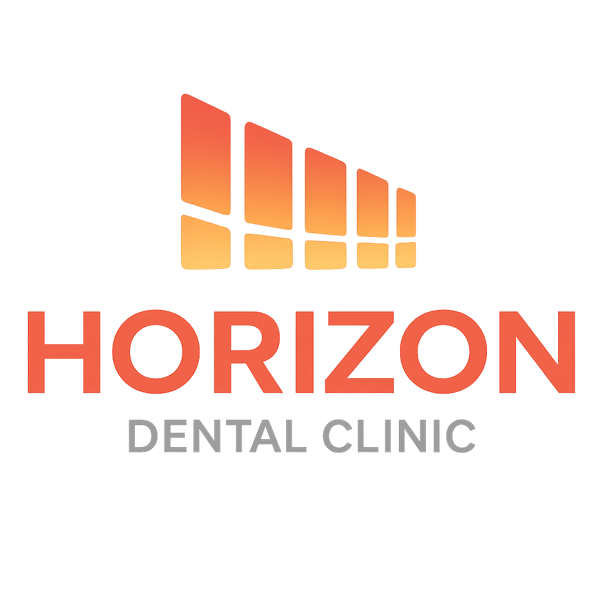

# Horizon Dental (Parody Website)

A modern **React-based dental clinic website** created as a parody of Skyline Dental.  
This project is built with **React, TailwindCSS, and React Router** to showcase a clean, responsive, and professional clinic-style design.

---

## Website Link
- **https://lukaaitken.github.io/horizon-dental**

## ✨ Features

- **Responsive Navigation Bar** with mobile-friendly hamburger menu  
- **Hero Banner** with parallax and slideshow support  
- **Home Page** with mission, services preview, and dentist highlights  
- **About Us Page** with clinic introduction and photo  
- **Services Page** with interactive accordion and optional detailed sub-pages  
- **Our Dentist Page** with profile section  
- **Contact Us Page** with clinic details and contact form structure  
- **Footer** with quick navigation and branding  
- **Scroll to Top** behavior when navigating between pages  

---

## 🛠️ Tech Stack

- **React 18**  
- **React Router DOM**
- **TailwindCSS**  
- **JavaScript (ES6+)**  
- **Vite**
- **GitHub Pages**
---

## 🚀 Getting Started

### 1. Clone the repository
git clone https://github.com/your-username/horizon-dental.git
cd horizon-dental

### 2. Install dependencies
npm install

### 3. Run development server
npm run dev

### 4. Build for production
npm run build